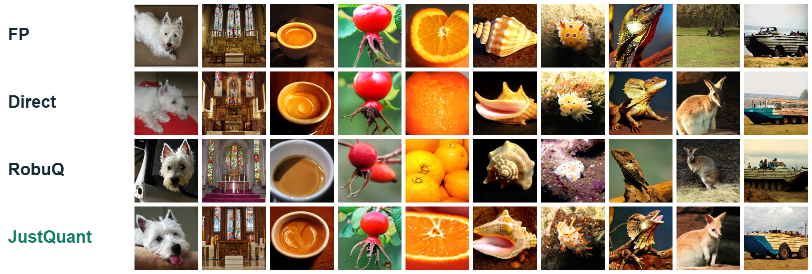
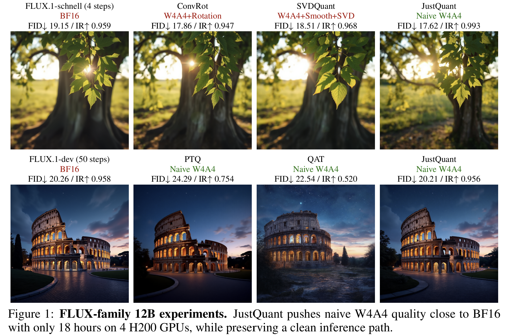
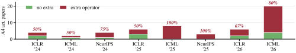
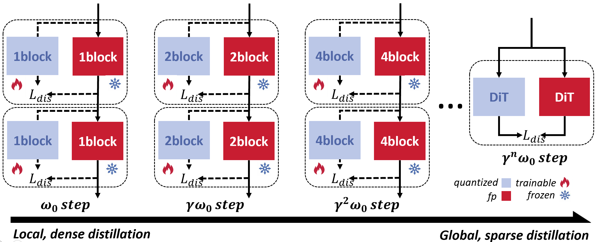
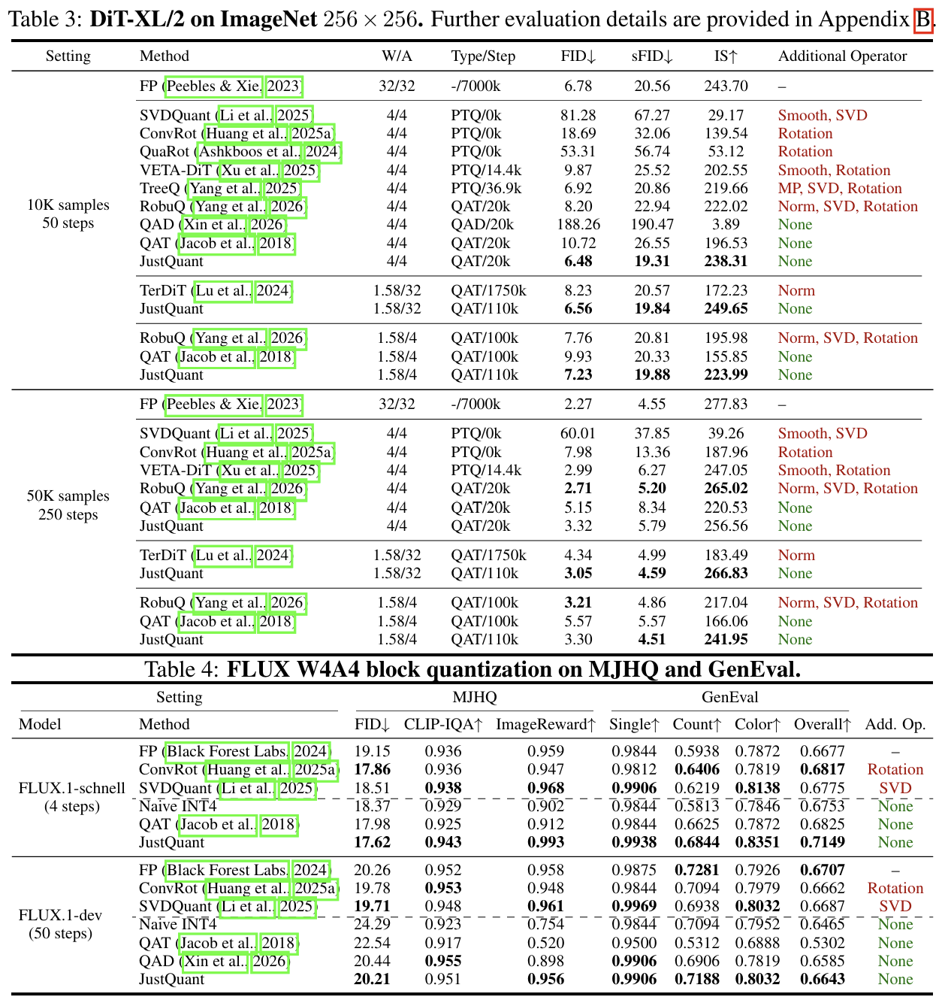

<div align="center">


# JustQuant

### You Don't Need Smoothing, SVD, or Rotation for 4-Bit Activation Quantization

<p>
  <a href="https://arxiv.org/abs/2609.33601">Paper</a>
  ·
  <a href="https://racoonykc.github.io/projects/justquant/">Project page</a>
  ·
  <a href="https://racoonykc.github.io/blog/justquant/">Blog</a>
</p>

<p>
  
  
</p>

</div>

<p align="center">
  
</p>

<p align="center">
  
</p>

## The idea

Low-bit inference often comes with a surprising amount of extra machinery: rotations, SVD branches, smoothing passes, and format-specific operators. **JustQuant** asks a simpler question:

> Can a model keep its intelligence when its deployed body is made of plain 4-bit operations?

Our answer is a training recipe based on **progressive distillation**. The student is low-bit from the beginning; supervision starts on short quantized segments and gradually expands to the full model. The deployment path stays simple: plain low-bit GEMM, without rotation, SVD, or smoothing at inference.

<p align="center">
  
</p>

## What we show

- Plain **W4A4** and **W1.58A4** operators can preserve strong generation quality.
- The same idea transfers across image generation, diffusion language generation, and diffusion language reasoning.
- Progressive distillation moves complexity into training while keeping the inference graph compact.
- The paper reports results on DiT-XL/2, FLUX.1, ELF-B, and LLaDA.

<p align="center">
  
</p>

## Evaluation snapshot

The paper's DiT-XL/2 and FLUX W4A4 tables summarize the quality and deployment trade-offs behind the method.

<p align="center">
  
</p>

## Paper

**JustQuant: You Don't Need Smoothing, SVD, or Rotation for 4-Bit Activation Quantization**

Kaicheng Yang*, Kaisen Yang*, Chunyu Liu*, Xianglong Yan, Haotong Qin, Junyi Wu, Tianao Zhang, Xun Zhang, Shaoqiu Zhang, Youbang Sun, and Yulun Zhang  
<br><sub>*Equal contribution.</sub>

- [arXiv abstract](https://arxiv.org/abs/2609.33601)
- [PDF](https://arxiv.org/pdf/2609.33601)
- [Interactive project page](https://racoonykc.github.io/projects/justquant/)

## Research context

This project grew out of previous work with **[Yulun Zhang (张宇伦)](https://yulunzhang.com/)** and current work with **[Weiyang Liu (刘威杨)](https://wyliu.com/)**.

## Open-source plan

Open weights, the training framework, inference code, and reproduction materials are **coming soon**.

## Citation

```bibtex
@article{yang2026justquant,
  title={JustQuant: You Don't Need Smoothing, SVD, or Rotation for 4-Bit Activation Quantization},
  author={Yang*, Kaicheng and Yang*, Kaisen and Liu*, Chunyu and Yan, Xianglong and Qin, Haotong and Wu, Junyi and Zhang, Tianao and Zhang, Xun and Zhang, Shaoqiu and Sun, Youbang and Zhang, Yulun},
  journal={arXiv preprint arXiv:2609.33601},
  year={2026},
  eprint={2609.33601},
  archivePrefix={arXiv},
  primaryClass={cs.LG}
}
```

## Acknowledgements

We thank the colleagues and open-source communities whose tools made the experiments possible.

<div align="center">

<br>
<sub>Plain operators. Progressive distillation. Intelligence preserved.</sub>

</div>
